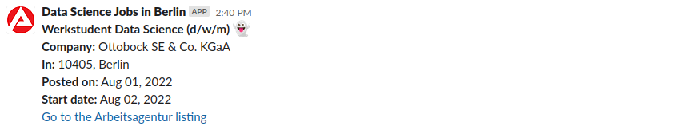

# *Slack bot for data science jobs in Berlin*
## API, MongoDB, Docker, ETLs, Webhooks and .env

This project was completed in week 6 of the Spiced Data Science Bootcamp in Berlin. The goal was to create a Slack bot, running on an AWS EC2, which automatically posts new data science job listings for Berlin in our cohort Slack channel once they get added to the Arbeitsagentur job database.

## Files

- [`docker-compose.yml`](docker_project/docker-compose.yml): Docker-Compose .yml file
- [`etl.py`](docker_project/etl_job/etl.py): Python script for the ETL process
- [`get_jobs.py`](docker_project/job_collector/get_jobs.py): Python script for scraping and saving the job listings into the MongoDB
- [`slack.py`](docker_project/slack_bot/slack.py): Python script of the slack bot
